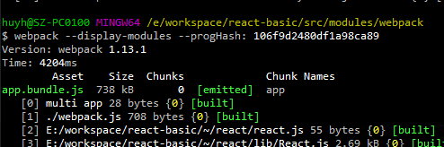
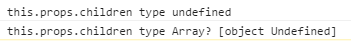
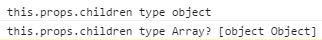
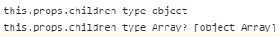
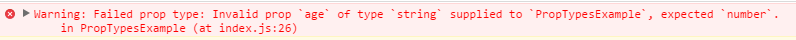
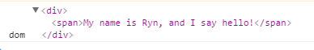

# react基础入门

## JSX语法

```javascript
const element = <h1>Hello, world!</h1>;
```

> This funny tag syntax is neither a string nor HTML.
>
It is called JSX, and it is a syntax extension to JavaScript. We recommend using it with React to describe what the UI should look like. JSX may remind you of a template language, but it comes with the full power of JavaScript.
>
JSX produces React "elements".

意思就是`jsx`语句既不是一个字符串，同时也不是`HTML`，它是`javascript`的扩展。没错，它是一个js文件，只是可以在js文件中直接写html标签，不用加任何标签。例如：

```javascirpt
var names = ['Alice', 'Emily', 'Kate'];

ReactDOM.render(
  <div>
  {
    names.map(function (name) {
      return <div>Hello, {name}!</div>
    })
  }
  </div>,
  document.getElementById('root')
);
```

规则：遇到`[HTML]`以（`<`）开头，遇到代码块以（`{`）开头

官网例子下载地址： [http://reactjs.cn/react/downloads/react-15.3.1.zip](http://reactjs.cn/react/downloads/react-15.3.1.zip)

## Hello World - 编写一个简单程序

* 直接引入方式, USE CDN

```javascript
<div id="root"></div>
<script src="https://unpkg.com/react@15.4.1/dist/react.min.js"></script>
<script src="https://unpkg.com/react@15.4.1/dist/react-dom.min.js"></script>
<script src="https://cdnjs.cloudflare.com/ajax/libs/babel-core/5.8.24/browser.min.js"></script>
<script type="text/babel">
    ReactDOM.render(
        <h1>Hello world</h1>,
        document.getElementById("root")
    );
</script>

// 引入browser.js是因为浏览器默认是不识别以jsx结尾的文件
// 因此需要使用browser.js进行转义
// 注意，此时script的类型为text/babel

// 如果没有引入browser.js，可以这么写（其实就相当于转义之后的写法）：
<script>
    function ExampleApplication() {
        // this equals to React.createElement('p', null, 'Hello world');
        return React.DOM.p(null, "Hello world");
    }

    // or React.createElement(ExampleApplication);
    var ExampleApplicationFactory = React.createFactory(ExampleApplication);

    ReactDOM.render(
        React.createElement(ExampleApplication),
        document.getElementById('root')
    );
</script>
```

* 使用`[babel]`提前编译

提前将`[jsx]`文件编译成`[js]`文件，在`[html]`文件中单独引入

注意： `babel` 6.0 之前的编译需要全局安装 `babel`， 而高于 6.0 版本的需要全局安装`babel-cli`，具体例子如下：

```javascript
// With Babel lower than 6.0

npm install -g babel
cd basic-jsx-precompile/
babel example.js --out-dir=build

// With Babel 6.0 or higher

npm install -g babel-cli
cd basic-jsx-precompile/
npm install babel-preset-react
babel example.js --presets react --out-dir=build
```

* 使用`[webpack]`或者`[Browserify]`之类的编译工具编译（`[Browserify]`没有研究过，下面主要介绍一下简单的`[webpack]`配置，可以参看之前的文档[webpack](https://github.com/Rynxiao/webpack-test)）

使用`[webpack]`需要配置`[webpack.config.js]`文件，具体如下：
```javascript
module.exports = {
    entry : {
        app : ['webpack.js']
    },
    output : {
        path : './assets/',
        filename : '[name].bundle.js',
        publicPath : './assets/'
    },
    module : {
        loaders : [
            // npm install babel-loader
            { test : /\.js|\.jsx$/, loader : 'babel' },
            { test : /\.css$/, loader : 'style!css' }
        ]
    }
};
```

生成的编译文件为`[app.bundle.js]`，可以直接在`[html]`文件中引入



## array && object

react中可以直接渲染数组，数组元素可以是简单的字符串，也可以是jsx语法中的元素定义，同时还可以使用`Array.prototype.map`来遍历数组，代码如下：

```javascript
React.createClass({
    render() {

        let arr = ['Lily', 'John', 'Ryn', "Harry"],
            arr2 = [<h1>Lily</h1>, <h1>John</h1>, <h1>Ryn</h1>, <h1>Harry</h1>];

        return (
            <div className="App">
                <p>1. 直接使用，会直接输出</p>
                {arr}
                <p>2. 数组中的元素可以是jsx语法中的元素</p>
                {arr2}
                <p>2. 可使用 [Array.prototype.map] 函数遍历</p>
                <ul>
                    {
                        arr.map((a , i) => {
                            return <li key={'a'+i}>{`Hello, I'm ${a}`}</li>
                        })
                    }
                </ul>
            </div>
        );
    }
});
```

对象使用`.`来使用，如：

```javascript
let obj = {name : 'Ryn', 'message' : 'hello'};

return (
    <div className="App">
        My name is {obj.name}, and I say {obj.message}!
    </div>
);
```

## this.props

`[this.props]`中的属性对应从组件传过来的属性，例如`<Hello sub="world" />`，那么在`Hello`组件中就可以使用`this.props.sub`来获取这个值。例如：

```javascript
/**
 * 调用方式
 * <PropsExample name="ryn" message="hello" />
 */

'use strict';

import React from 'react';

export default React.createClass({
    render() {
        return (
            <div className="App">
                My name is {this.props.name}, and I say {this.props.message}!
            </div>
        );
    }
});
```

**注意特殊的**：**`[this.props.children]`,它表示组件的子节点**

但是`[this.props.children]`可能会有三种类型，当组件下没有子节点的时候，它的值类型是`undefined`，有一个子节点时，它的类型是`Object`，当有超过两个子节点时，它的类型是`Array`，例如：

```javascript
/**
 * 调用方式
 * <NodeList>
 *     <span>I'm a NodeList Component's child.</span>
 *     <span>I'm a NodeList Component's child.</span>
 * </NodeList>
 */

'use strict';

import React from 'react';

export default React.createClass({
    render() {
        console.log("this.props.children type", typeof this.props.children);
        console.log("this.props.children type Array?", Object.prototype.toString.call(this.props.children));
        return (
            <ol>
                {
                    React.Children.map(this.props.children, function (child) {
                        return <li>{child}</li>;
                    })
                }
            </ol>
        );
    }
});
```

如下调用时：

```javascript
<NodeList />
```
截图：



```javascript
<NodeList>
    <span>I'm a NodeList Component's child.</span>
</NodeList>
```

截图：



```javscript
<NodeList>
    <span>I'm a NodeList Component's child.</span>
    <span>I'm a NodeList Component's child.</span>
</NodeList>
```

截图：



`[React]`提供了一个工具方法`React.Children`来帮助处理`【this.props.children】`，使用`React.children.map`可以不需要理会组件下到底是有几个节点，从而避免意外的错误产生。

## PropTypes

`【PropTypes】`提供了一种验证机制，来提醒用户使用组件时应该要传一些什么值，如果传的值不符合规范，只会得到一个`warnning`的提示，不会报错。例如：

更多的类型校验请参考官网：[https://facebook.github.io/react/docs/typechecking-with-proptypes.html](https://facebook.github.io/react/docs/typechecking-with-proptypes.html)

```javascript
/**
 * 调用方式
 * <PropsTypesExample name="ryn" age="12" />
 */

import React from 'react';

export default React.createClass({

    propTypes : {
        name : React.PropTypes.string.isRequired,
        age : React.PropTypes.number.isRequired
    },

    render() {
        return (
            <div className="App">
                <span>My name is {this.props.name}, {this.props.age} years old!</span>
            </div>
        );
    }
});
```

会得到一个警告，如下：



另外，还有一个`getDefaultProps`钩子函数，用来设置组件的默认`【props】`，注意，这个钩子方法当多次被调用的时候，只会被执行一次。例如：

```javascript
/**
 * 调用方式
 * <DefaultPropsExample />
 */

import React from 'react';

export default React.createClass({

    getDefaultProps() {

        console.log("default execute!");

        return {
            name : 'Ryn',
            age : 12
        }
    },

    render() {
        return (
            <div className="App">
                <span>My name is {this.props.name}, {this.props.age} years old!</span>
            </div>
        );
    }
});

// 当我连续两次调用时，例如：
ReactDOM.render(
    <div>
        <DefaultPropsExample />
        <DefaultPropsExample />
    </div>,
    document.getElementById("root")
);

// 控制台只会出现一次打印结果，如下
```

！[execute-once](./screensnap/execute-once.png)

## refs(获取真实的DOM元素)

可以使用`[this.refs.xxx]`来获取真实的DOM节点，或者使用`ReactDOM.findDOMNode(this.refs.xxx)`，例如：

```javascript
/**
 * 调用方式
 * <RefsExample />
 */

import React from 'react';

export default React.createClass({

    handleClick() {
        let dom = this.refs.introduce;
        // or ReactDOM.findDOMNode(this.refs.introduce)
        console.log("dom", dom);
    },

    render() {
        return (
            <div className="App">
                <div ref="introduce" onClick={this.handleClick}>
                    <span>My name is Ryn, and I say hello!</span>
                </div>

            </div>
        );
    }
});
```

DOM节点打印如下：



## event

触发事件，在`refs`中已经涉及到了DOM元素的`click`事件，更多的事件可以参看官网：[https://facebook.github.io/react/docs/events.html](https://facebook.github.io/react/docs/events.html)，这里主要讲一下事件中的传参问题。

React中的事件传参，如果没有传参，只需要这样调用：

```javascript
<p className="hello" onClick={this.handleClick}>hello world!</p>
```

如果需要传参，则需要绑定`this`，如果没有绑定，则会变成直接调用函数了。例如：

```javascript
<p className="hello" onClick={this.handleClick.bind(this, 1)}>hello world!</p>
```

接收函数，没有传参时，默认第一个参数是`event`事件对象，如果传参，则最后一个参数是事件对象，例如：

```javascript
/**
 * 调用方式
 * <EventExample />
 */

import React from 'react';

export default React.createClass({

    handleClick(num, e) {
        e.preventDefault();
        console.log("clicked", num);
    },

    render() {
        return (
            <div className="App">
                <div onClick={this.handleClick.bind(this, 1)}>
                    <span>My name is Ryn, and I say hello!</span>
                </div>
            </div>
        );
    }
});
```

## state(组件的状态)

`state`表示组件的状态，当一个状态发生变化时，会重新触发`render`函数。注意，请将`state`和`props`区分开，比较好的理解就是，`props`只是表示组件的属性，不是可变的，但是一个组件的状态是可以变化的，这时候就要用到`state`。例如如下的例子，会在每一秒改变元素的颜色：

```javascript
/**
 * 调用方式
 * <StateExample />
 */

import React from 'react';

export default React.createClass({

    getInitialState() {
        return {
            isRed : true
        }
    },

    componentDidMount() {
        this.inter = window.setInterval(() => {
            this.setState({isRed : !this.state.isRed});
        }, 1000);
    },

    componentWillUnmount() {
        window.clearInterval(this.inter);
    },

    render() {

        let isRed = this.state.isRed, styles;

        styles = isRed ? {
            width : '100px',
            height : '100px',
            backgroundColor : 'red'
        } : {
            width : '100px',
            height : '100px',
            backgroundColor : 'blue'
        };

        return (
            <div className="App">
                <div style={styles}></div>
            </div>
        );
    }
});
```

## 表单

React中的表单分为**受限**组件与**不受限**组件，受限组件受到组件本身控制，需要由`state`来维护，不可随意更改，而不受限组件是由DOM本身控制，可以修改。React官方建议是采用受限组件来进行表单提交。详情可以看这里：

[https://facebook.github.io/react/docs/forms.html](https://facebook.github.io/react/docs/forms.html)

[https://facebook.github.io/react/docs/uncontrolled-components.html](https://facebook.github.io/react/docs/uncontrolled-components.html)

下面是一个例子：

```javascript
/**
 * 调用方式
 * <FormExample />
 */

import React from 'react';

export default React.createClass({

    getInitialState() {
        return {
            name : 'ryn',
            age : 12
        }
    },

    changeInput(event) {
        this.setState({name : event.target.value});
    },

    changeSelect(event) {
        this.setState({age : event.target.value});
    },

    render() {
        return (
            <div className="App">
                <div>
                    <label htmlFor="name">name:</label>
                    <input type="text" name="name" value={this.state.name} onChange={this.changeInput} />
                </div>
                <div>
                    <label htmlFor="age">age:</label>
                    <select value={this.state.age} onChange={this.changeSelect}>
                        <option value="11">11</option>
                        <option value="12">12</option>
                        <option value="13">13</option>
                        <option value="14">14</option>
                        <option value="15">15</option>
                    </select>
                </div>
            </div>
        );
    }
});
```

## react生命周期

react生命周期主要包括三个阶段：初始化阶段、运行中阶段、销毁阶段

react在不同的生命周期会触发不同的钩子函数

想了解更多请参看官网：[https://facebook.github.io/react/docs/react-component.html](https://facebook.github.io/react/docs/react-component.html)

### 初始化阶段

`getDefaultProps()` 设置组件默认的属性， 注意这个钩子函数只会在组件第一次实例化的时候被调用，多次实例化的组件会共享同一份`props`

`getInitialState()` 组件的初始化状态，可以通过用户的操作来更改组件自身的状态

`componentWillMount()` 在组件即将被渲染到页面(组件还没有真正渲染)

`render()`  组件渲染

`componentDidMount()` 组件被渲染到页面上，在该方法中可通过`this.getDOMNode()`访问到真实的DOM元素。此时已可以使用其他类库来操作这个DOM

### 运行中阶段

`componentWillReceiveProps()` 组件接收到属性的时候调用，当组件的属性发生变化的时候，并将其作为参数`nextProps`使用，此时可以更改组件`props`及`state`
```javascript
componentWillReceiveProps: function(nextProps) {
    if (nextProps.bool) {
        this.setState({
            bool: true
        });
    }
}
```

`shouldComponentUpdate()` 当组件接收到新的属性或者新的状态发生变化的时候执行(在某些情况下当属性或者状态不发生变化的时候可以手动`return false`)

组件是否应当渲染新的`props`或`state`，返回`false`表示跳过后续的生命周期方法，通常不需要使用以避免出现`bug`。在出现应用的瓶颈时，可通过该方法进行适当的优化

`componentWillUpdate()` 组件即将要被更新的时候调用（接收到新的props或者state后，进行渲染之前调用，此时不允许更新props或state）

`render()` 组件渲染

`componentDidUpdate()` 组件被更新完成之后调用，此时可以访问到新的DOM元素

### 销毁阶段

`componentWillUnmount()` 组件被销毁的时候被调用，给开发者最后的机会进行一些清理操作，比如对定时器的操作等等...

## DOM元素

> In React, all DOM properties and attributes (including event handlers) should be camelCased. For example, the HTML attribute tabindex corresponds to the attribute tabIndex in React. The exception is aria-* and data-* attributes, which should be lowercased.

在React中，所有的属性都必须采用驼峰式写法。例外就是`aria-*`和`data-*`之类的，必须采用小写。

几个常用的不同点：

* class -> className

```javascript
<p className="title">hello</p>
// but not
<p class="title">hello</p>
```

* for -> htmlFor

```javascript
<label htmlFor="name">name:</label>
// but not
<label for="name">name:</label>
```

* style

```javascript
<div style={{padding:'10px',margin:'10px'}}></div>
// but not
<div style="padding:10px;margin:10px;"></div>
```

更多的不同点可以自己去官网了解 [https://facebook.github.io/react/docs/dom-elements.html](https://facebook.github.io/react/docs/dom-elements.html)

## 参考链接

[https://facebook.github.io/react/docs/hello-world.html](https://facebook.github.io/react/docs/hello-world.html)

[http://www.ruanyifeng.com/blog/2015/03/react.html](http://www.ruanyifeng.com/blog/2015/03/react.html)

[http://wiki.jikexueyuan.com/project/react/](http://wiki.jikexueyuan.com/project/react/)

[https://github.com/Rynxiao/react-starter](https://github.com/Rynxiao/react-starter)


